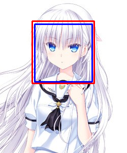
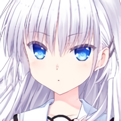

# Anime Face Dataset


This is a tool kit to generate a dataset of anime faces. With default setting, over 8000 image samples will be generated. This dataset contains no meta info itself, but you can use tools, such as Illustration2Vec[1], to estimate by yourself. This dataset is a edited version of Jin, Y.'s work[2].

**CAUTION: Too many times of scaling with tools like Wifu2x might introduce unexpected noise and 'fold lines' into images and blur outlines of characters, which leads to a bad result and even mode collapse if it is used to train a GAN model. To balance the quality and size of image, we highly recommend you NOT TO SCALE IMAGES FOR MORE THAN TWO TIMES.**

**If you're just looking for some dataset with high-resolution (more than 128\*128px) anime faces, this project does not fit your requirement.**

## Why this dataset

Previous attempts to generate high-quality anime face images with Generative Adversarial Network (GAN) always use spider-collected images from websites on which everyone could upload its art work. This leads to the unstable quality of and huge variation between images. On the contrary, CGs in video games enjoy stable and high-quality features, which means it fit our requirements very well. This dataset is made up from these images.

## Where does images come from?

We collect those images from [Getchu](http://www.getchu.com), with the guidance of the result we gain from [Erogame Space](http://erogamescape.dyndns.org/~ap2/ero/toukei_kaiseki/sql_for_erogamer_form.php). The specific SQL statement could be found in [2], we select the games sold after the year of 2013 in order to gain better images.

## Usage and Discription

As one can reproduce this dataset easily, we do not upload our dataset files onto this repository. Instead, you could follow the instructions below to construct your own one.

### Use SQL to gain game info

On [Erogame Space](http://erogamescape.dyndns.org/~ap2/ero/toukei_kaiseki/sql_for_erogamer_form.php), use the statement below to get game infos:

```SQL
SELECT g.id, g.gamename, g.sellday, 'www.getchu.com/soft.phtml?id=' || g.comike as links
 FROM gamelist g
 WHERE g.comike is NOT NULL AND g.sellday >= '20130101'
 ORDER BY g.sellday
```

After results are shown, save the html file to your work folder.

### Use spider to capture images from Getchu

To make you understand what we're doing better, we will raise the portrait of Naruse Shiroha (鳴瀨 しろは) in Game [*Summer Pocket*](http://www.getchu.com/soft.phtml?id=989183) as an example. In this section, we aims to get images like this:


After editing the path parameter in file to the html you saved in previous section, use our spider based on scrapy to capture all available images:

```bash
# We highly recommend you to read the code we provide and edit some key parameters before using
# For instance: the path of html file and the folder to save images
# Run this command in spider folder
scrapy crawl gameurl
```

### Use [Libcascade Animeface](https://github.com/nagadomi/lbpcascade_animeface) to detect and crop out faces

With libcascade animeface, one can easily detect anime faces in images like below:



In some cases, the original box (shown as the blue one) that the algorithm gives is not large enough, so we apply a 1.5x scaling (shown as the red one) on it.

After getting the box position, one can use opencv2 tools to crop it into face-only images like:


To do this, run code below after installing needed modules of libcascade animeface:

```bash
# Before running, you're supported to install all required modules of libcascade animeface
# Before running, create needed folder
python face_detector.py source_dir output_dir
```

### Use [Wifu2x](https://github.com/nagadomi/waifu2x) to scale faces to 128^2

*Attention: Limited by our server, we choose to use [another version of Wifu2x](https://github.com/yu45020/Waifu2x). The result may vary due to the usage of different versions*

As the cropped face image is too small, we need to use Wifu2x to reach our expectation. After doing so, you should get images like:



Run command below in the `scaler/Wifu2x` folder to scaling your images:

```bash
# You could edit code inside to specify your device
# CPU can get better result, while GPU is about 5x faster than CPU
# You can choose to use Wifu2x(UpConv7) or CRAN_v2(default)
# target_dir should be created before running
python face_scaler.py source_dir target_dir
```

## What if I scale it for too many times?

To test the performance of [my Style-based GAN model](https://github.com/SiskonEmilia/StyleGAN-PyTorch), I used an edited version of this dataset, in which I scaled the face for three times rather than two, to train it. After over one GPU-week's training (on 2 Nvidia Tesla P100 GPUs), the result I got is unacceptable:


As my model could show its generated images periodically, I got to find that when the resolution is small (smaller than 256\*256 px), the result is nice and with diverse characteristics. As the size growing large, the style of images seems to be fixed and the detail looks quite wired and unnatural, which is highly different from the amazing result that Nvidia's and [Gwern Branwen's work](https://www.gwern.net/TWDNE#). Thus there're reasons for me to believe that too many times of scaling is what causes this unexpected result.

## References

[1] Pre-trained model available on http://illustration2vec.net/

[2] Jin, Y., Zhang, J., Li, M., Tian, Y., Zhu, H., & Fang, Z. (2017). Towards the Automatic Anime Characters Creation with Generative Adversarial Networks, 92(Summer 2017), 1–16. Retrieved from http://arxiv.org/abs/1708.05509